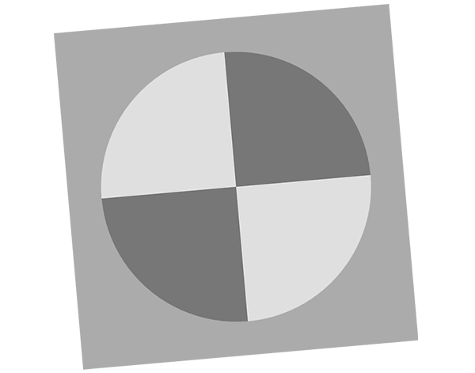

# python-image-processing

Hello, my name is Dustin Lehmkuhl and I am a chemical engineering gradute student and hobbyist computational scientist.
I have been recreating various image processing algorithms and following a few openCv tutorials. The results are posted here.

# SFR Detection

# Checkerboard Detection and Analysis

# Algorithm Recreation of Kernel Masks and Canny Edge Detection

# OpenCv Tutorial work
